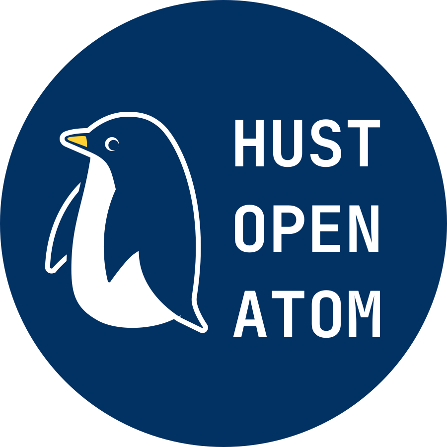
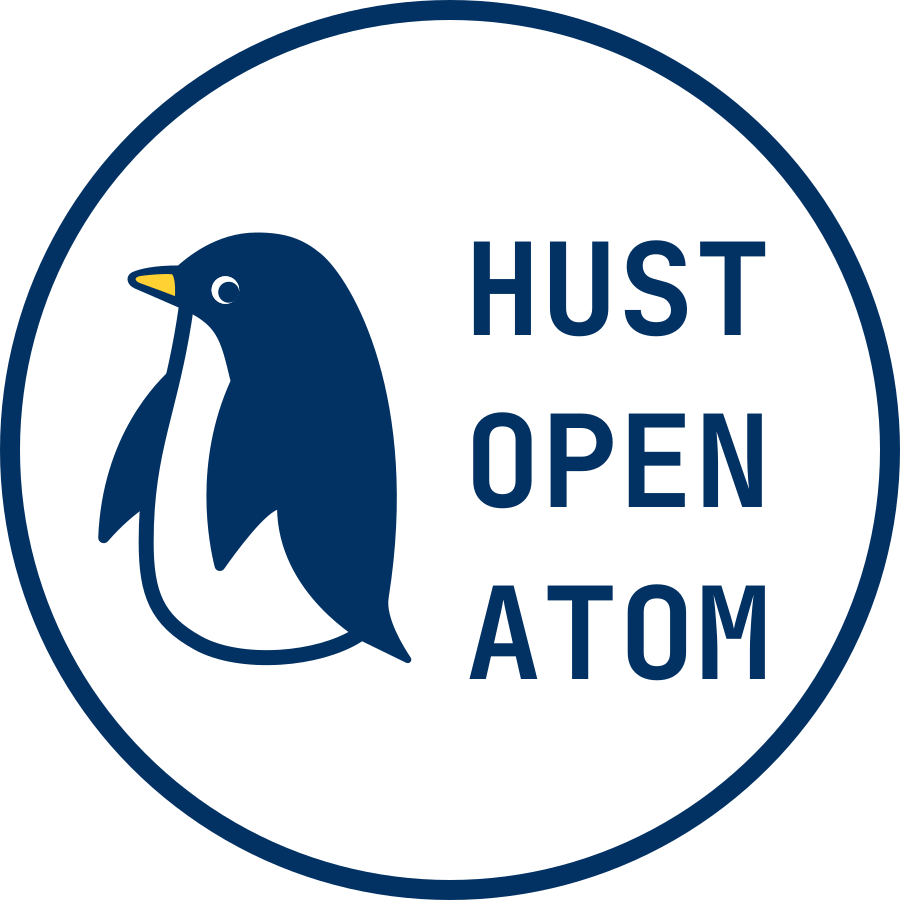
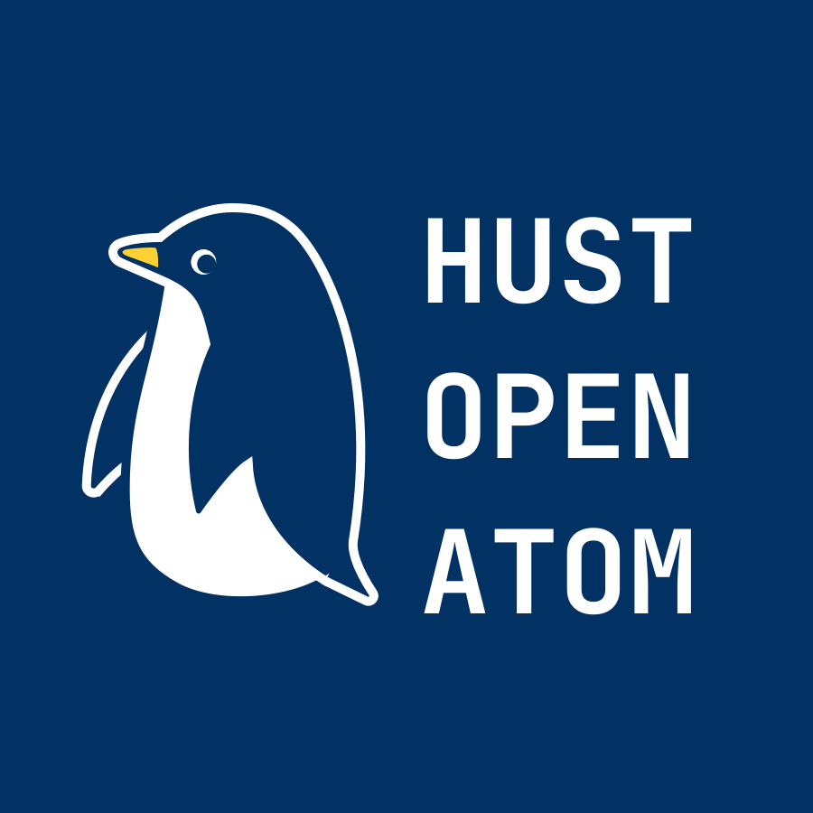
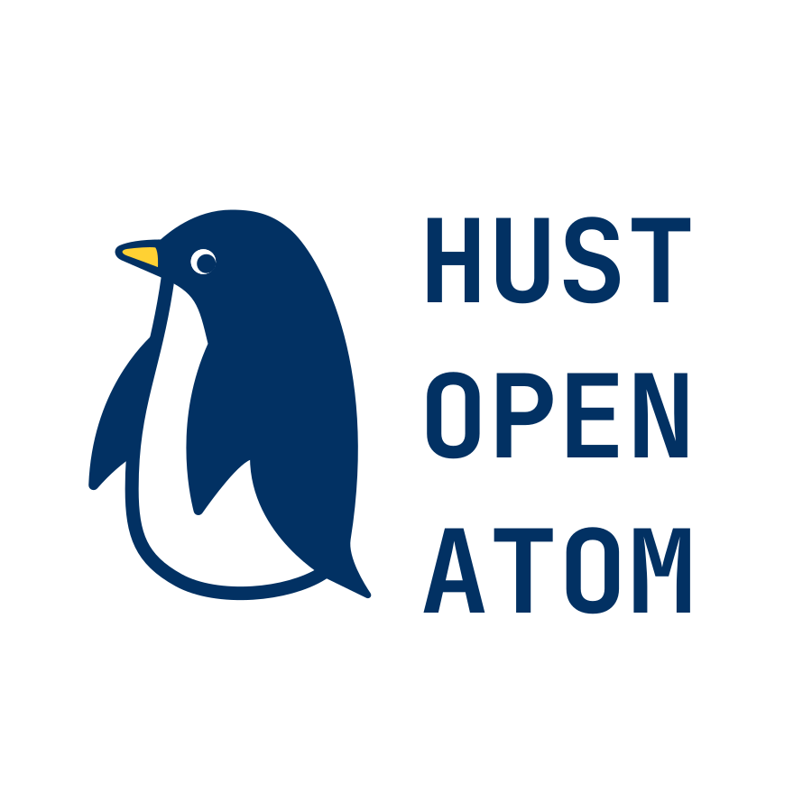
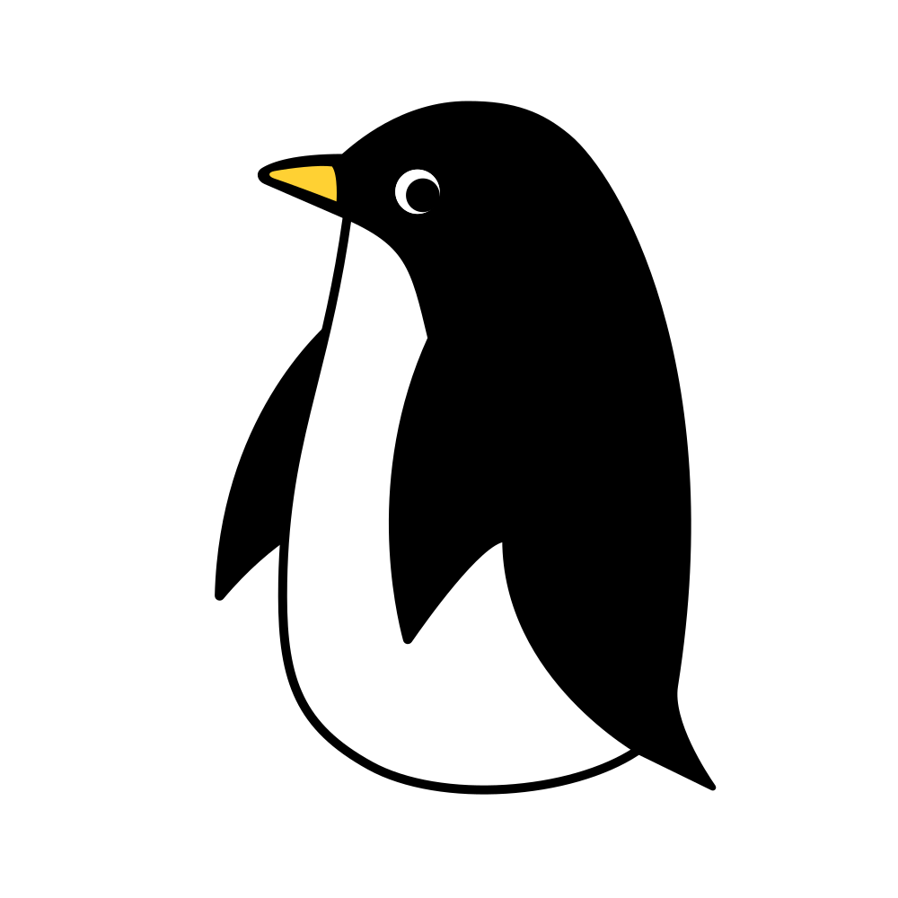
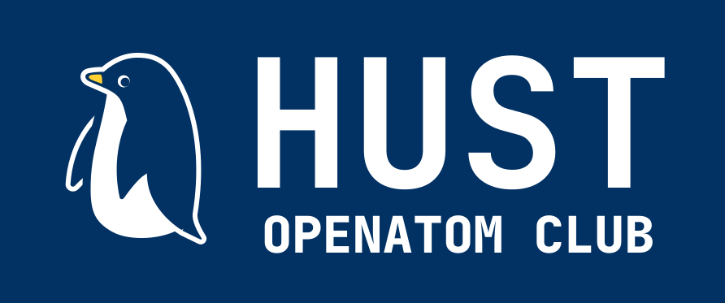
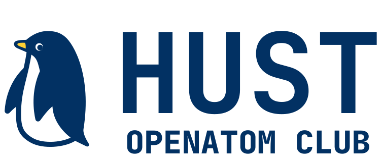

# Logos for HUST OpenAtom Open Source Club

License: CC-0

Please contact [@jingfelix](https://github.com/jingfelix) if you have any question.

If you would like to modify these files to make your own little penguins, I recommanded Figma which helped me built them.

## Examples

